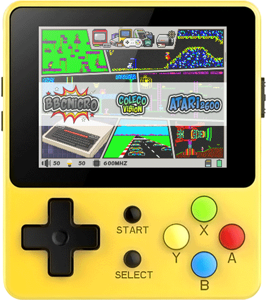

  

# New Comic Book Theme
Made by Segich (Sergei Babko, Belarus) with the support of <a href="https://boards.dingoonity.org/profile/simpleasy/" target="_blank">SimplEasy</a> and <a href="https://boards.dingoonity.org/profile/jutley/" target="_blank">Jutleys</a> for RetroFW for LDK game system.
This skin  will be works with all game handhelds with RetroFW on board.

  

# How to install (update)
- download <i><b>NewComicBook.tar</i></b> from <a href="https://github.com/SergeiBabko/new-comic-book/releases" target="_blank">release page</a>
- remove previous versions from the <i><b>apps/gmenu2x/skins/</b></i> folder
- <i><b>'NewComicBook'</b></i> folder from <i><b>NewComicBook.tar</i></b> archive must be copied to <i><b>apps/gmenu2x/skins/</b></i> folder
- go to the <i><b>'Skin'</b></i> settings and use left/right to find and select <i><b>'NewComicBook'</b></i> skin 
- go to the <i><b>'Skin' > 'Wallpaper'</b></i> section and select one of 10 wallpapers you like the most
- confirm your choice with <i><b>'Start'</b></i> button
- have fun with a super-duper <i><b>'NewComicBook'</b></i> theme :blush:
